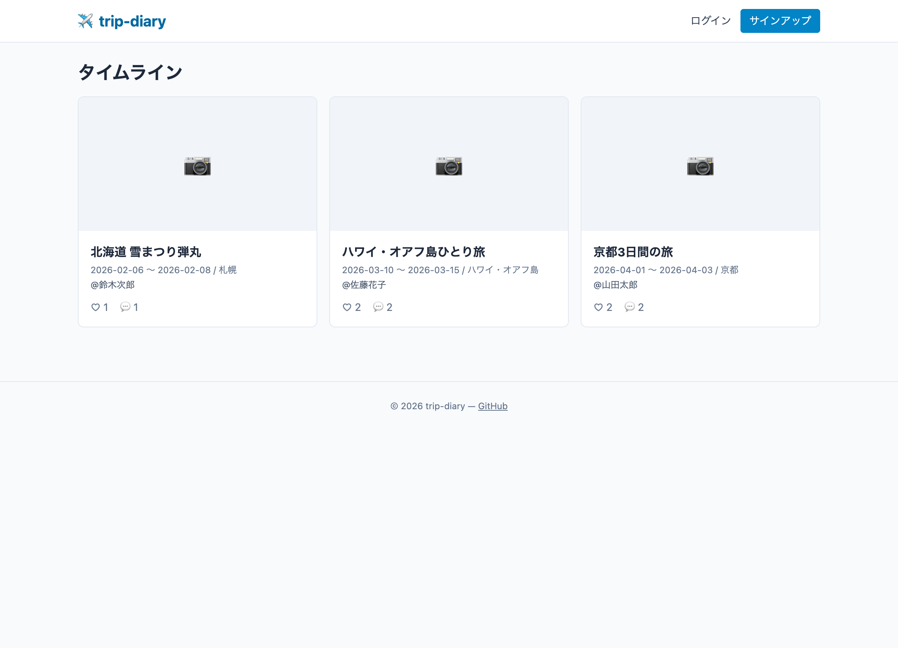
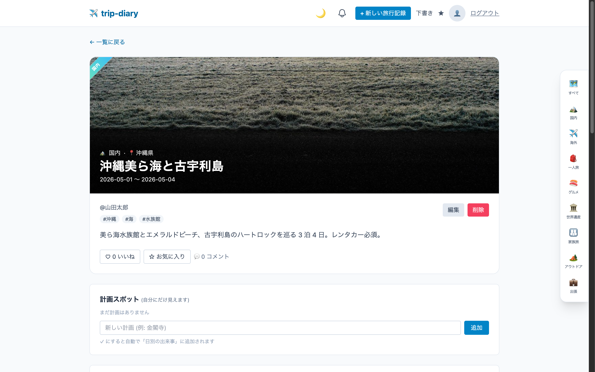
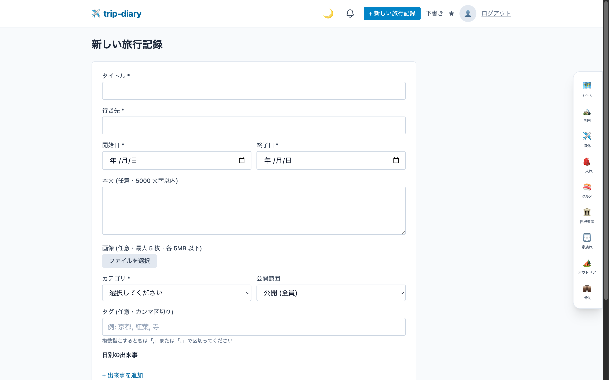

# 旅行記録アプリ (trip-diary)

[](https://github.com/80-cloud/trip-diary/actions/workflows/ci.yml)
[](LICENSE)
[](https://www.ruby-lang.org)
[](https://rubyonrails.org)
[](https://nodejs.org)
[](https://nuxt.com)

> 自分の旅行を時系列で記録し、複数ユーザー同士でコメント・いいね・お気に入り・フォロー・レビューを通じて反応し合える Web アプリです。
> スクール提出物として、**Ruby on Rails 8.1** + **Nuxt 4 (純 JS)** + **MySQL 8** で構築しています。

学習姿勢: **習う → 慣れる → マスター** ([docs/学習ロードマップ.md](docs/学習ロードマップ.md) 参照)

---

## 📦 講師提出物 (Deliverables)

| 提出物 | 場所 |
|---|---|
| **GitHub リポジトリ** | https://github.com/80-cloud/trip-diary |
| **README (本ファイル)** | [README.md](README.md) — 機能/技術/起動手順/テスト/カバレッジ/curl 疎通/シードユーザー |
| **設計書一式** (10 種) | [docs/](docs/) — 要件定義 / 機能一覧 / 画面設計 / ER 図 / 技術スタック / インフラ構成 / ログ・監視・障害対応 / テスト計画 / セキュリティ自己監査 / 学習ロードマップ |
| **CLAUDE.md** | [CLAUDE.md](CLAUDE.md) — Claude Code 行動規範 (Issue ファースト / Conventional Commits / テスト運用ルール) |
| **CI 実行履歴** | [Actions タブ](https://github.com/80-cloud/trip-diary/actions) — 全 PR で backend (Rails Minitest + zeitwerk) + frontend (Vitest + Nuxt build) が緑であること |
| **PR 一覧** | [Pulls (closed)](https://github.com/80-cloud/trip-diary/pulls?q=is%3Apr+is%3Aclosed) — 全機能を Issue → ブランチ → PR → セルフレビュー → CI 緑 → マージで進めた履歴 |

> **ローカル動作確認用シードユーザー**: `taro@example.com` / `password` (他 2 アカウントの一覧は本 README 下部 「シードユーザー」参照)

---

## 差別化ポイント (他の旅行 SNS / 一般 SNS との違い)

| 項目 | Instagram / 一般 SNS | trip-diary |
|---|---|---|
| 投稿単位 | 写真 1 枚〜数枚に紐づくキャプション | **「1 つの旅行」が単位**。複数日の出来事 (DayEntry) を 1 つの旅行記録にネスト |
| 計画と記録 | 別アプリ (旅のしおりは別) | **同一画面で計画 → 実記録に昇格** (F-PLAN-02) |
| 持ち物管理 | なし (備忘録は別アプリ) | **trip 単位の持ち物チェックリスト** (F-PACK-01) |
| 公開範囲 | public / private の 2 値 | **public / friends (相互フォロー限定) / private** の 3 値 + draft 状態 |
| インプレッション競争 | 表示回数を煽る | **不採用** (いいね数のみ。再シェア機能なし → 炎上拡散抑制) |
| 拡散機能 | リポスト / リツイート | **なし** (個人の旅行記憶を残すことが目的) |
| お気に入り | 「保存」相当 | **いいね (公開反応) と お気に入り (私的ブックマーク) を分離** |
| 個人メモ | なし | **他人の trip にも自分専用メモを残せる** (公開されない) |
| レビュー | コメント欄に混在 | **trip 単位の 5★ + 振り返り本文** を独立して扱う |

---

## スクリーンショット

### タイムライン (S-03)


### 旅行記録 詳細 (S-04)


### 新規作成 / 日別ネストフォーム (S-05)


---

## 主要機能

### Phase 1 (MVP) ✅ — [PR #2](https://github.com/80-cloud/trip-diary/pull/2)

- ユーザー認証 (サインアップ / ログイン / ログアウト) — JWT in HttpOnly Cookie
- 旅行記録の **CRUD** (タイトル / 行き先 / 期間 / 本文 / 公開範囲)
- 日別の出来事 (DayEntry) を **ネストフォーム**で 1 画面登録 / 編集
- 画像アップロード (ActiveStorage / 最大 5 枚)
- **コメント** (140 文字以内 / 自分のもののみ削除)
- **いいね** (1 ユーザー 1 記録 1 回 / counter_cache)

### Phase 2 (発展機能) ✅ — 6 機能群 + CI 実装済

| Phase | 機能群 | PR |
|---|---|---|
| 2-1 | **タグ / カテゴリ / 検索高度化** (多対多関連 / scope / 複合 AND 検索 / LIKE エスケープ) | [#16](https://github.com/80-cloud/trip-diary/pull/16) |
| CI | **GitHub Actions CI** (backend Rails Minitest + frontend Vitest + build を全 PR で自動実行) | [#18](https://github.com/80-cloud/trip-diary/pull/18) |
| 2-2 | **下書き / ダークモード / 無限スクロール** (enum 状態管理 / `darkMode: class` + localStorage / IntersectionObserver + cursor pagination) | [#20](https://github.com/80-cloud/trip-diary/pull/20) |
| 2-3 | **お気に入り / 個人メモ** (uniqueness 二段防衛 / upsert race rescue / 本人専用リソースの認可境界) | [#22](https://github.com/80-cloud/trip-diary/pull/22) |
| 2-4 | **フォロー / フォロー中タイムライン** (自己参照関連 / `friends`=相互フォロー可視性 / N+1 防止 pre-fetch + Set) | [#24](https://github.com/80-cloud/trip-diary/pull/24) |
| 2-5a | **計画モード / 荷物チェックリスト** (trip-owned 子リソースの CRUD / done → DayEntry 自動昇格 / 進捗集計) | [#26](https://github.com/80-cloud/trip-diary/pull/26) |
| 2-5b | **チケット管理 / 旅行レビュー** (ActiveStorage 単体添付 + MIME/size 制限 / 1 trip 1 review upsert) | [#28](https://github.com/80-cloud/trip-diary/pull/28) |

### Phase 3 (本番デプロイ) 🚧 計画中

- 通知センター (コメント / いいね / フォロー受信)
- 地図表示 (Leaflet / MapLibre)
- 統計ダッシュボード (都道府県制覇率 / 月別集計)
- S3 への画像移行
- **AWS デプロイ** (EC2 + RDS + Nginx / Terraform)

### Phase 4 (発展余地) 📅 検討中

- リアルタイム反映 (ActionCable)
- PWA (オフライン閲覧)
- 多言語 (i18n)
- PDF 出力

詳細は [docs/機能一覧.md](docs/機能一覧.md) を参照。

### テスト規模 (2026-05-17 時点)

| 種別 | 件数 | カバレッジ |
|---|---|---|
| Backend (Minitest) | 183 件 / 521 assertions GREEN | Line 89.51% / Branch 70.14% |
| Frontend (Vitest) | 12 件 GREEN | `@vitest/coverage-v8` 設定済 (`npm run test:coverage`) |

---

## 技術スタック

| レイヤー | 採用技術 |
|---|---|
| バックエンド | Ruby 3.4.9 / Rails 8.1 (API モード) |
| フロントエンド | Nuxt 4 + Vue 3 / Tailwind CSS (**TypeScript 不採用 = 純 JS**) |
| DB | MySQL 8 (Docker) |
| 認証 | JWT in HttpOnly Cookie |
| 画像 | ActiveStorage (Disk / Phase3 で S3) |
| インフラ (Phase3) | AWS EC2 + RDS + Terraform |

### 使用ポート

| サービス | ポート |
|---|---|
| Rails API | 3010 |
| Nuxt | 3011 |
| MySQL | 3316 |

> recipe-board (3000/3001/3306) と同時起動可能なよう分離しています。

---

## クイックスタート

### 前提

- macOS / Linux
- Docker Desktop インストール済み
- Ruby 3.4.9 (rbenv 等で管理)
- Node.js v22 以上

### 起動手順

```bash
# 1. クローン
git clone https://github.com/80-cloud/trip-diary.git
cd trip-diary

# 2. 環境変数を準備
cp .env.example .env
# .env を編集 (パスワード / SECRET_KEY_BASE / JWT_SECRET を設定)
# SECRET_KEY_BASE: cd backend && bundle exec rails secret
# JWT_SECRET     : openssl rand -hex 64

# 3. MySQL を起動
docker compose up -d db

# 4. バックエンドのセットアップ・起動
cd backend
bundle install
bin/rails db:create db:migrate db:seed
bin/rails s -p 3010 -b 0.0.0.0

# 5. フロントエンドのセットアップ・起動 (別ターミナル)
cd frontend
npm install
PORT=3011 npm run dev
```

ブラウザで http://localhost:3011 を開く。

### テスト実行

```bash
# バックエンド (Rails Minitest / 標準同梱)
cd backend
bin/rails db:test:prepare   # 初回 / schema 変更後
bin/rails test              # 全テスト実行

# フロントエンド (Vitest)
cd frontend
npm test                    # ワンショット実行
npm run test:watch          # 監視モード
```

テスト方針の全体像は [docs/テスト計画書.md](docs/テスト計画書.md) を参照。

### テストカバレッジ

```bash
# Backend (SimpleCov)
cd backend
bin/rails test
open coverage/index.html    # ブラウザでカバレッジ詳細を確認

# Frontend (@vitest/coverage-v8)
cd frontend
npm run test:coverage
open coverage/index.html
```

> 現状の閾値は 0% (生成のみ確認 / Phase 2 末時点の実測は backend Line 89.51%)。段階目標は [docs/ログ・監視・障害対応設計書.md §5](docs/ログ・監視・障害対応設計書.md) を参照。

### API 疎通確認 (curl)

```bash
# ヘルスチェック
curl -sS http://localhost:3010/api/v1/health

# 一覧取得 (未ログイン = 公開のみ)
curl -sS http://localhost:3010/api/v1/trips | head -c 200

# ログイン (Cookie を /tmp/c.txt に保存)
curl -sS -c /tmp/c.txt -X POST http://localhost:3010/api/v1/login \
  -H 'Content-Type: application/json' \
  -d '{"email":"taro@example.com","password":"password"}'

# ログイン状態確認
curl -sS -b /tmp/c.txt http://localhost:3010/api/v1/me

# いいね
curl -sS -b /tmp/c.txt -X POST http://localhost:3010/api/v1/trips/2/like

# コメント投稿
curl -sS -b /tmp/c.txt -X POST http://localhost:3010/api/v1/trips/2/comments \
  -H 'Content-Type: application/json' -d '{"body":"テストコメント"}'
```

### シードユーザー (開発用)

| email | password | 役割 |
|---|---|---|
| taro@example.com | password | 一般ユーザー |
| hanako@example.com | password | 一般ユーザー |
| jiro@example.com | password | 一般ユーザー |

---

## ドキュメント

| ドキュメント | 内容 |
|---|---|
| [docs/要件定義書.md](docs/要件定義書.md) | プロジェクト目的 / 機能要件 / 非機能要件 / 講師要件マッピング |
| [docs/機能一覧.md](docs/機能一覧.md) | 機能 ID / 優先度 / Phase / 関連画面 |
| [docs/画面設計書.md](docs/画面設計書.md) | 画面一覧 / 遷移図 / ワイヤーフレーム |
| [docs/ER図.md](docs/ER図.md) | テーブル定義 / インデックス設計 |
| [docs/技術スタック.md](docs/技術スタック.md) | 採用技術と理由 |
| [docs/インフラ構成.md](docs/インフラ構成.md) | ローカル + AWS 構成 |
| [docs/ログ・監視・障害対応設計書.md](docs/ログ・監視・障害対応設計書.md) | 観測可能性 / SLI・SLO / Runbook |
| [docs/テスト計画書.md](docs/テスト計画書.md) | テストレベル / 技法 / カバレッジ目標 / 手動チェックリスト |
| [docs/セキュリティ自己監査.md](docs/セキュリティ自己監査.md) | sns-board 10 教訓の Rails 転用 + 監査結果 |
| [docs/学習ロードマップ.md](docs/学習ロードマップ.md) | 習う → 慣れる → マスター |
| [CLAUDE.md](CLAUDE.md) | Claude Code 行動規範 (Issue ファースト / Conventional Commits 等) |

---

## 開発ワークフロー

### Issue ファースト (直接 main push 禁止)

```
① GitHub で Issue を作成 (テンプレート使用)
       ↓
② Issue 番号を確認 (例: #25)
       ↓
③ ブランチ作成: git switch -c feature/#25-plan-packing
       ↓
④ 受け入れ条件をテストに 1:1 写経 → 実装 → ローカル GREEN
       ↓
⑤ PR を作成 (--label 必須) / Closes #25 で Issue リンク
       ↓
⑥ CI 緑 (GitHub Actions) + セルフレビュー反映 → Squash and merge
       ↓
⑦ ローカル main を git pull で同期
```

詳細ルールは [CLAUDE.md](CLAUDE.md) 参照 (ブランチ命名 / コミット形式 / PR テンプレ / 認可ルール)。

### ブランチ命名規則

| 種別 | 命名パターン | 例 |
|---|---|---|
| 新機能 | `feature/#番号-説明` | `feature/#25-plan-packing` |
| バグ修正 | `fix/#番号-説明` | `fix/#15-trip-save-bug` |
| ドキュメント | `docs/#番号-説明` | `docs/#29-readme-for-submission` |
| 雑務・設定 | `chore/#番号-説明` | `chore/#17-github-actions-ci` |

### コミットメッセージ規則

Conventional Commits 形式・**日本語**・50 字以内:

```
feat: 計画モード + 荷物チェックリスト (Phase 2-5a)

- PlannedSpot モデル / done=true で DayEntry 自動昇格
- PackingItem モデル / trip 単位のチェックリスト
- Minitest 125 → 153 件

Closes #25

Co-Authored-By: Claude Opus 4.7 <noreply@anthropic.com>
```

種別: `feat` / `fix` / `docs` / `style` / `refactor` / `test` / `chore`

### 全 PR で適用したセルフレビュー文化

Phase 1 〜 Phase 2 の **全 PR** で「初回 push → セルフレビュー反映 → 再 push → CI 緑 → マージ」を実施。
PR ごとに **隠れバグ 1〜3 件を発見・修正** している (race condition / N+1 / silent failure / 認可境界の漏れ など)。

---

## 学習成果として意識したこと

> 学習姿勢の全体像は [docs/学習ロードマップ.md](docs/学習ロードマップ.md)。
> このセクションは **本プロジェクトを通じて実際に身につけた具体的な学習成果** を可視化するもの。

### 各 Phase で意識した学習テーマ

| Phase | 機能 | 意識した学習ポイント |
|---|---|---|
| 1 | 認証 / Trip CRUD / コメント / いいね | JWT in HttpOnly Cookie の安全性 / ネストフォーム (accepts_nested_attributes_for) / counter_cache の整合性 |
| 2-1 | タグ / カテゴリ / 検索 | **多対多関連** / scope chain / 複合 AND 検索 / **LIKE エスケープによる SQL injection 防止** |
| CI | GitHub Actions 導入 | **CI を「文化」として根付かせる** (ローカル緑 ≠ CI 緑 / 全 PR を CI で守る) |
| 2-2 | 下書き / ダークモード / 無限スクロール | **Rails enum + 状態遷移** / Tailwind `darkMode: class` + localStorage / **cursor pagination + IntersectionObserver** |
| 2-3 | お気に入り / 個人メモ | **uniqueness 二段防衛** (validation + DB unique index) / 本人専用リソースの認可境界 |
| 2-4 | フォロー / フォロー中タイムライン | **自己参照関連** / through 関連 / `friends`=相互フォロー判定 |
| 2-5a | 計画モード / 荷物 | trip-owned 子リソースの CRUD パターン / **after_update_commit による状態遷移ロジックの一元管理** (done → DayEntry 自動昇格) |
| 2-5b | チケット / レビュー | ActiveStorage 単体添付 + MIME/size 制限 / 1 trip 1 review の **upsert + race rescue** |

### 横断的に身についた設計判断

- **受け入れ条件 → テスト → 実装** の順序 (CLAUDE.md §11-2): Issue に Given/When/Then を書き、まずテストに 1:1 写経してから実装する
- **認可境界の徹底**: `Trip.visible_to(current_user)` を全リソース (likes/comments/favorites/memos/tickets/planned_spots/packing_items) で通し、他人の draft / private trip は 404 で隠す
- **race condition の二段防衛**: uniqueness は **validation + DB unique index** の両方で守る。さらに API では **RecordInvalid (validation race) + RecordNotUnique (DB race)** を両方 rescue して upsert に倒す (PR #22 で確立 → PR #24 #28 で継承)
- **N+1 防止の pre-fetch + Set パターン**: trip 一覧で `current_user.likes` / `favorites` / `followings` を **1 クエリで先取り → Set 参照** に統一 (PR #20/#22/#24 で確立)
- **楽観 UI の世代管理**: 無限スクロール中にフィルタ変更で古いレスポンスが混入する race を **loadGen 世代カウンタ**で破棄 (PR #20)
- **enum 不正値で 500 を出さない サニタイズ**: status/category/kind の不正値は controller で安全側 (nil / "other") に倒し、422 に変換 (PR #16/#20/#28)
- **本人専用ビューと公開情報の責務分離**: tickets/planned_spots/packing_items の中身は本人のみ / 進捗バーや review (旅行レビュー) は公開、を Set + `is_owner` で出し分け (PR #26/#28)
- **「存在の漏洩」を防ぐ 404 統一**: 「見えるが書込不可 = 403」「存在しない or 見えない = 404」を使い分け、RecordNotFound を Rails 標準で統一

### 横断的に身についた開発プロセス

- **Issue ファースト + Conventional Commits 日本語**: 全 PR で例外なく適用 ([Pulls (closed)](https://github.com/80-cloud/trip-diary/pulls?q=is%3Apr+is%3Aclosed) 参照)
- **セルフレビュー → 隠れバグ発見 → 再 push** を全 PR で 1 周以上回し、**毎 PR で 1〜3 件の隠れバグを発見・修正** (race / N+1 / silent failure / 認可境界の漏れ など。各 PR 本文に「セルフレビューで発見・修正したバグ」セクションあり)
- **CI 緑がマージの実質ゲート** (branch protection は別途設定): PR #18 の CI 導入以降、全 feature PR で `backend (rails test) + frontend (vitest + build)` の両 job 緑を確認してからマージ
- **セキュリティ自己監査の継続適用**: sns-board の 10 教訓 (`docs/セキュリティ自己監査.md`) を Rails 文脈に転用し、毎 PR で E-H1 (識別子漏洩) / E-H2 (SQL injection) / E-L5 (race) を回帰固定
- **「想定外シナリオ」の検証習慣**: PR 本文に毎回「想定外シナリオの調査結果」表を載せ、不正値 / 並行 race / 未ログイン / フィルタ後の状態変化 などを最低 8〜13 件検証

---

## AI 利用方針 (提出物としての透明性)

- スクール提出物のため、**AI (Claude Code) の利用は許可されているが、透明性を最重視**
- 全コミットに `Co-Authored-By: Claude Opus 4.7 <noreply@anthropic.com>` を付与
- 重要な設計判断は **コミットメッセージ / PR 本文で人間が承認した旨を明示**
  - 例: 「マージしたのでプル」「次を実行」など人間の指示を起点に作業を進める
  - 例: PR セルフレビューで「これは別 Issue 候補」など人間判断を残す
- AI が独断で進めた範囲と人間判断は区別 (PR 本文の「セルフレビューで発見・修正したバグ」セクション参照)
- AI 行動規範は [CLAUDE.md](CLAUDE.md) で明文化し、毎セッション読み込ませている

---

## 本番デプロイ前チェックリスト (Phase 3 / ECS Fargate 構成)

> **インフラ構成**: ECS Fargate + ALB + CloudFront + ECR + RDS MySQL + S3 + SSM Parameter Store (詳細: [docs/インフラ構成.md §2 v0.2](docs/インフラ構成.md))。姉妹 PJ sns-board の構成を踏襲。

### 既存チェック (Phase 2 までで定義)

- [ ] `RAILS_ENV=production` で起動 (development のままだと `seeds.rb` が本番 DB を汚染する — 詳細は [docs/セキュリティ自己監査.md §3 E-H3](docs/セキュリティ自己監査.md))
- [ ] `SECRET_KEY_BASE` / `JWT_SECRET` を本番用の値に差し替え (`.env.example` の値は使わない / `rails secret` で生成)
- [ ] `bin/rails db:seed` を本番デプロイ手順から **除外** (本 PR の deploy-backend.sh / Task Definition init container にも含めない)
- [ ] `CORS_ORIGINS` を本番ドメインに限定 (`localhost:3011` 混入チェック)

### ECS 構成での追加チェック (Issue #55 で確定)

- [ ] **Active Storage**: `config.active_storage.service = :amazon` を確認 (本 PR #56 で対応 / 起動時は `S3_BUCKET` / `S3_REGION` 環境変数が SSM 経由で注入されている必要あり)
- [ ] **シークレット**: SSM Parameter Store に SecureString で投入 (`RAILS_MASTER_KEY` / `DATABASE_URL` / `JWT_SECRET` / `SECRET_KEY_BASE` / `CORS_ORIGINS` / `S3_BUCKET` / `S3_REGION`)
- [ ] **IAM Role**: ECS task_role に S3 uploads bucket スコープの `s3:PutObject/GetObject/DeleteObject` + SSM `GetParameters` + KMS `Decrypt` を付与
- [ ] **Image Tag**: `latest` 禁止、git commit SHA を使用 (sns-board と同方針、E-H3 と同型の事故防止)
- [ ] **Platform**: Apple Silicon Mac は `docker buildx --platform linux/amd64` で push (ECS Fargate は amd64 のみ)
- [ ] **ACM 証明書**: ALB は ap-northeast-1 / CloudFront は us-east-1 で発行 (リージョン要件)
- [ ] **terraform plan**: 人間目視で確認 (`-auto-approve` 禁止 / CLAUDE.md §6)
- [ ] **DB migration**: `bin/rails db:migrate RAILS_ENV=production` を本番 RDS に対して実行 (seed は実行しない)

### Phase B 据え置き (本セッションスコープ外 / Issue #55 で確定)

- [ ] Picsum フォールバック → Active Storage stock 画像 attach runner (Phase B)
- [ ] E2E (Playwright) シナリオ 5-7 件 + CI 統合 (Phase B / テスト計画書 §1 §2 §7 改訂)
- [ ] CSRF X-CSRF-Token 方式 (Phase B / [docs/セキュリティ自己監査.md](docs/セキュリティ自己監査.md) E-CSRF)
- [ ] E-L5 signup race / E-PWReset (Phase B / 公開後の運用判断)
- [ ] CloudWatch アラーム (CPU > 80% / 5xx / RDS IOPS) (Phase B)
- [ ] AWS Budgets 月次 $30 上限通知 (Phase B / sns-board の budgets.tf port)

---

## 運用 Runbook (Phase 3 / ECS Fargate)

学習用 + 講師レビュー想定のため、**使う時だけ apply / 終わったら撤収** のサイクルで運用しコストを最小化する。

### 利用パターンと月額目安

| パターン | 月稼働時間 | 月額 | 用途 |
|---|---|---|---|
| 24h 常時稼働 | 720h | ~$30 | 講師レビュー期間中 (継続公開) |
| 1日3h | 90h | ~$4 | デモ準備 + 公開 |
| 30h/月 (1日1h or 月数回半日) | 30h | ~$1.2 | レビュー前のリハーサル |
| 0h (撤収状態) | 0h | $0.5 未満 | tfstate bucket / Budget メールのみ残る |

→ 講師レビュー期間が決まっているなら、レビュー前日 apply → 終了後 teardown が最安。

### A. 初回 apply (デプロイ)

```bash
# 0a. 事前準備 (一度だけ): tfstate 用 S3 bucket を手動作成 (versions.tf 参照)
#     既に存在する場合は skip (aws s3api head-bucket --bucket trip-diary-tfstate)
aws s3api create-bucket --bucket trip-diary-tfstate --region ap-northeast-1 \
  --create-bucket-configuration LocationConstraint=ap-northeast-1
aws s3api put-bucket-versioning --bucket trip-diary-tfstate \
  --versioning-configuration Status=Enabled
aws s3api put-public-access-block --bucket trip-diary-tfstate \
  --public-access-block-configuration 'BlockPublicAcls=true,IgnorePublicAcls=true,BlockPublicPolicy=true,RestrictPublicBuckets=true'
aws s3api put-bucket-encryption --bucket trip-diary-tfstate \
  --server-side-encryption-configuration '{"Rules":[{"ApplyServerSideEncryptionByDefault":{"SSEAlgorithm":"AES256"}}]}'

# 1. tfvars 準備 (機密鍵類を生成)
cp infra/terraform.tfvars.example infra/terraform.tfvars
# → 全 REPLACE_WITH_* を実値に置換 (db_password / rails_master_key / secret_key_base / jwt_secret / s3_bucket_name / budget_notification_email)
# 機密ファイルなので owner-only に絞る
chmod 600 infra/terraform.tfvars

# 2. terraform 初期化 + 計画確認 + 適用
cd infra
terraform init
terraform plan          # 63 リソース作成予定を目視確認
terraform apply         # y/n プロンプトに yes (-auto-approve は使わない / CLAUDE.md §6)
# 所要 15-20 分 (CloudFront 単体で ~10 分)

# 3. backend image push + ECS rolling
cd ..
./scripts/deploy-backend.sh

# 4. frontend (Nuxt SSG) を S3 + CloudFront に配信
./scripts/deploy-frontend.sh

# 5. 動作確認
terraform -chdir=infra output cloudfront_domain_name
# → ブラウザで https://<domain>/ を開く
# 注: CloudFront のエッジ伝播に追加で 5-15 分かかる場合あり (初回 deploy 後 5xx が出たら待つ)

# 6. AWS Budgets 確認メール対応 (初回 apply 後 5-30 分で届く)
# → budget_notification_email 宛 "AWS Notification - Subscription Confirmation"
#   のリンクをクリックして confirm (未 confirm だと月次通知が届かない)
```

### B. 緊急停止 (Fargate 課金のみ止める / 構成は残す)

```bash
# desired_count=0 で ECS task を 0 にする (ALB / RDS / CloudFront は維持)
aws ecs update-service \
  --cluster trip-diary-cluster \
  --service trip-diary-backend \
  --desired-count 0 \
  --region ap-northeast-1
# → 復旧時は --desired-count 1 で戻す (rolling 起動 ~3 min)
# 削減幅: ~$3-9/月 (Fargate Spot 分のみ / ALB $18 と RDS は引き続き課金)
```

### C. 撤収 (全リソース取り壊し)

```bash
# 安全装置付きの teardown スクリプトを使用 (2 段階確認 + 残存検証)
./scripts/teardown.sh --dry-run    # まず確認 (terraform plan -destroy 相当)
./scripts/teardown.sh              # 本実行 (プロジェクト名 + yes の 2 段階入力)

# 撤収後の確認 (script 内で自動実行されるが手動でも)
aws ecs list-services --cluster trip-diary-cluster
aws elbv2 describe-load-balancers --query "LoadBalancers[?starts_with(LoadBalancerName,'trip-diary')]"
aws rds describe-db-instances --query "DBInstances[?starts_with(DBInstanceIdentifier,'trip-diary')]"
aws cloudfront list-distributions --query "DistributionList.Items[?contains(Comment,'trip-diary')]"
```

⚠ **撤収で消えるもの**: 投稿された trip / 画像 / ユーザーアカウント全て (RDS + S3 uploads が中身ごと撤収される)。デモデータが必要なら apply 後に再 seed が必要。

### D. 撤収後も残るもの (要手動確認)

| 残るリソース | 対処 |
|---|---|
| `trip-diary-tfstate` S3 bucket | 次回 apply で再利用するので残置推奨。完全削除は AWS Console で手動 |
| AWS Budgets (月次 $30 通知) | 通知メール宛先が残る。不要なら AWS Console > Budgets で削除 |
| SNS Subscription (Budgets 通知) | 上記と同様 |
| Route53 hosted zone | 本構成では未作成 / カスタムドメイン採用時のみ |
| CloudWatch log groups | retention 7 日で自然消滅 |

### E. 鍵類のローテーション / 保護

**運用中の必須対策**:
```bash
# tfvars は全シークレット (DB password / Rails master key / JWT secret 等) を含むため
# owner-only に絞る (group / other からの読取り禁止)
chmod 600 infra/terraform.tfvars
ls -la infra/terraform.tfvars   # -rw------- であること
```

**講師レビュー終了 + 撤収後**は以下を破棄推奨:
- `infra/terraform.tfvars` の `db_password` / `secret_key_base` / `jwt_secret` / `rails_master_key` を破棄 (再 apply するなら再生成)
- SSM Parameter Store の SecureString も上記 terraform 撤収で削除済

再現性のため `infra/terraform.tfvars` を保管したい場合は、機密値を 1Password 等のパスワードマネージャに退避 + ローカルの tfvars は安全削除 (`shred -u infra/terraform.tfvars` or macOS なら `srm` / 単純な rm でも可)。

---

## ディレクトリ構成

```
trip-diary/
├── README.md, CLAUDE.md, LICENSE, .gitignore, .env.example, docker-compose.yml
├── docs/             # 設計書一式
├── backend/          # Rails 8.1 API
├── frontend/         # Nuxt 4 (JS)
├── db/               # MySQL データ (gitignore)
├── scripts/          # 補助スクリプト
├── infra/            # (Phase3) Terraform
└── .github/          # PR / Issue テンプレ
```

---

## 改訂履歴 (README)

各設計書 (`docs/*.md`) の改訂履歴は当該ドキュメント先頭を参照。

| 日付 | 内容 |
|---|---|
| 2026-05-17 | Phase 1 MVP 完成に伴う初版 (機能/技術/起動手順/curl/シードユーザー) |
| 2026-05-17 | Phase 2 全 6 PR + CI 完了に伴う全面改訂。提出物 (Deliverables) 表 / CI バッジ / LICENSE / 差別化ポイント / 開発ワークフロー / AI 利用方針 を追加 (PR #30) |

---

## クレジット

- 開発: hideharu-AI (スクール在籍中)
- 技術ベース: [recipe-board](https://github.com/80-cloud/recipe-board) の構成を流用
- 設計書体系: sns-board を参考
- 開発支援: [Claude Code](https://claude.com/claude-code) (講師推奨)
