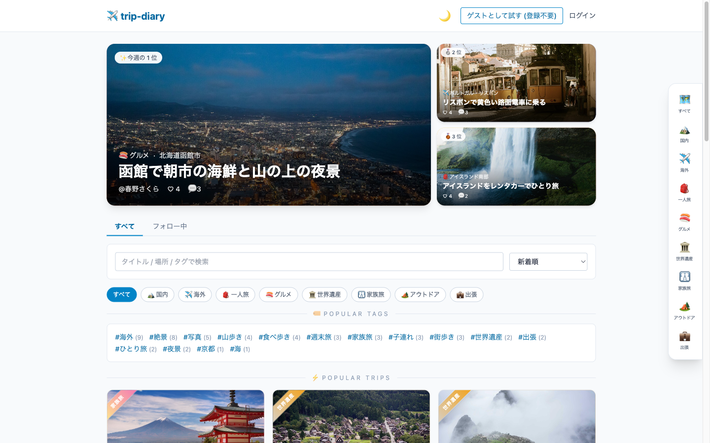
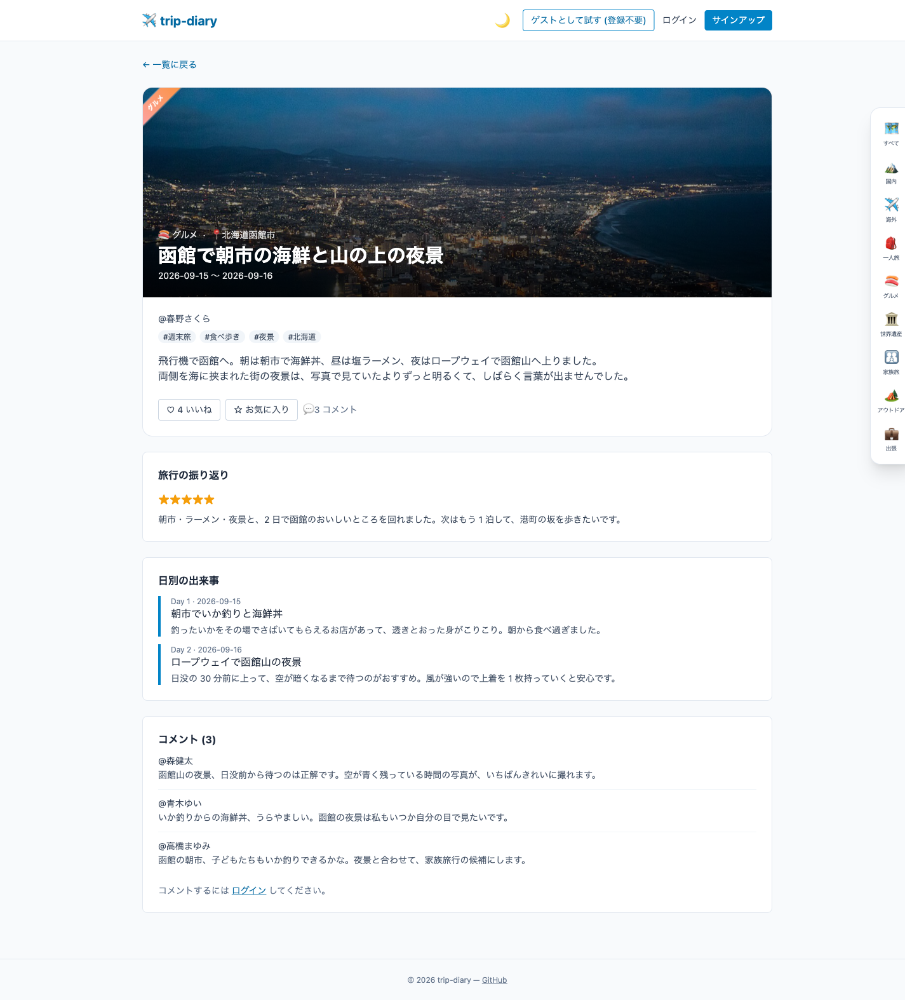
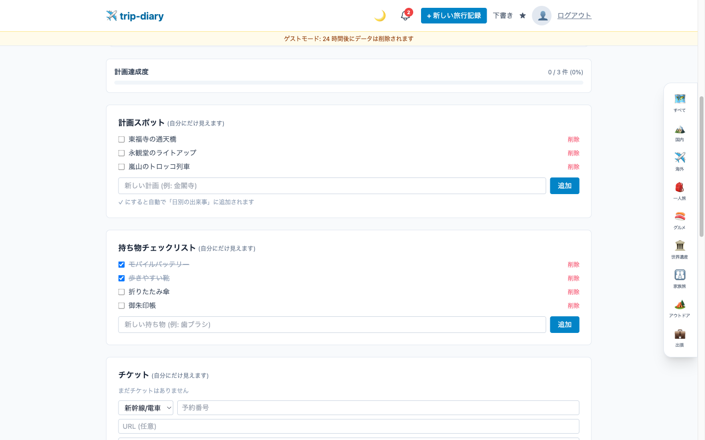
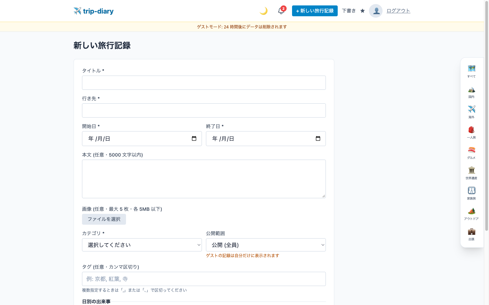

# trip-diary — 旅の記録を時系列で残し、反応し合う Web アプリ

[](https://github.com/80-cloud/trip-diary/actions/workflows/ci.yml)
[](LICENSE)
[](https://www.ruby-lang.org)
[](https://rubyonrails.org)
[](https://nodejs.org)
[](https://nuxt.com)

旅行を「1 つの旅」単位で、日ごとの出来事と写真とともに記録し、ほかのユーザーとコメント・いいね・フォローで反応し合える Web アプリです。
Ruby on Rails 8.1 (API) + Nuxt 4 + MySQL 8 で作っています。

| 項目 | 内容 |
|---|---|
| デモ URL | 公開準備中 |
| 試し方 | 画面右上の「ゲストとして試す」を押すだけで、登録なしで操作できます |
| 初回の表示 | 無料のサーバーを使っているため、しばらくアクセスが無いと停止します。最初の表示に 1 分ほどかかることがあります |



---

## 何ができるか

- 旅行を記録する: タイトル・行き先・期間・カテゴリ・タグに加え、日ごとの出来事と写真を 1 つの画面でまとめて登録できます
- 旅の前に計画する: 行きたい場所の一覧と持ち物のチェックリストを作れます。行った場所は、その日の記録に移せます
- 反応し合う: ほかの人の旅行にコメント・いいね・お気に入りを付け、気になる人をフォローできます
- 通知を受け取る: コメント・いいね・フォローを受けると、ヘッダーの鈴に未読の数が出ます
- 探す: キーワード・カテゴリ・タグで絞り込めます。一覧は下までスクロールすると続きを読み込みます
- 公開範囲を選ぶ: 全員に公開・相互フォローの人だけ・自分だけ、の 3 段階と下書きがあります





---

## 30 秒で試す

1. デモ URL を開き、右上の「ゲストとして試す」を押します
2. トップの一覧から、デモユーザーの旅行を 1 つ開きます
3. いいねを押し、コメントを書きます
4. ヘッダーの鈴を開くと、デモユーザーからのフォローの通知が届いています
5. 「新しい旅行記録」から、自分の旅行を記録します

ゲストの制限:

- ゲストのデータは 24 時間後に削除されます
- ゲストの旅行は「自分だけ」に固定され、ほかの人には見えません
- 画像は、旅行の画像・チケット・アバターを合わせて 5 枚までです



---

## 技術スタック

| レイヤー | 採用技術 |
|---|---|
| バックエンド | Ruby 3.4.9 / Ruby on Rails 8.1 (API モード) |
| フロントエンド | Nuxt 4 / Vue 3 / Tailwind CSS (JavaScript。TypeScript は使っていない) |
| DB | MySQL 8 (開発は Docker) |
| 認証 | JWT を HttpOnly Cookie に入れる方式 |
| 画像 | Active Storage (開発: ディスク / 公開環境: Cloudinary / 過去の本番: S3) |
| テスト | Minitest / Vitest / Playwright (E2E) / k6 (性能) |
| CI | GitHub Actions (lint・テスト・ビルド・脆弱性・E2E・月次の性能テスト) |

採用理由は [docs/技術スタック.md](docs/技術スタック.md) にまとめています。

---

## 設計で工夫したこと

- **認証**: JWT を HttpOnly Cookie に入れ、JavaScript から読めないようにしています。ログアウトしたトークンは失効リスト (`revoked_jtis`) に入れ、有効期限内でも使えないようにしています
- **見えないものは 404**: 他人の下書きや非公開の旅行は、コメント・いいねなどの子リソースも含めて 404 で隠し、存在自体を知られないようにしています
- **件数も権限で守る**: 本人だけが見られる一覧は、中身だけでなく件数などの集計値も同じ条件で隠しています
- **重複の二重防止**: いいね・お気に入りなどの重複は、モデルの検証と DB の一意制約の両方で防ぎ、同時に押されたときの例外も受け止めています
- **N+1 の防止**: 一覧では、自分のいいね・お気に入り・フォローを 1 回のクエリで先に取り出し、Set で照合しています
- **通知の自動生成**: コメント・いいね・フォローが作られたときに、モデルのコールバックで通知を作ります
- **ゲストの設計**: 訪問者ごとに一時ユーザーを作ります。同時に有効なゲストは 200 人まで、ゲストログインは同じ IP から 10 分に 5 回までです。期限切れのゲストは、次のゲストログインのときに関連データごと削除します
- **デモデータ**: YAML から作るタスク (`demo:seed`) は、何度実行しても件数が増えません。本番では確認用の環境変数を付けたときだけ動きます

---

## 品質の担保

| 種別 | 件数 | カバレッジ |
|---|---|---|
| Backend (Minitest) | 319 件 | Line 93.86% / Branch 79.38% |
| Frontend (Vitest) | 34 件 | 全体 Line 6.83% / composables Line 59.02% |
| E2E (Playwright) | smoke 1 件 | — |
| 性能 (k6) | シナリオ 6 種 | — |

- 数字は 2026-09-28 時点の実測です
- Frontend の単体テストは composables とストアが対象です。画面の部品には単体テストが無く、E2E と手動の確認手順 ([docs/テスト計画書.md](docs/テスト計画書.md) §8) で確かめています
- CI では rubocop・ESLint・Minitest・Vitest・Nuxt のビルド・brakeman・bundle-audit・npm audit をすべての PR で実行しています
- セキュリティは [docs/セキュリティ自己監査.md](docs/セキュリティ自己監査.md) の観点で PR ごとに確認しています

---

## インフラ

- **現行**: 無料で公開し続けられる構成へ移行中です (Render・TiDB Cloud・Cloudinary を予定)
- **過去の本番構成 (2026-05)**: AWS の ECS Fargate + RDS + ALB + CloudFront + S3 を Terraform で構築し、公開していました
- **移行の理由**: 常時公開すると月に約 30 ドルかかるため、公開デモを月額 0 円で続けられる構成に切り替えます

過去の構成と運用手順は [docs/インフラ構成.md](docs/インフラ構成.md) に残しています。Terraform のコードは [infra/](infra/) にあります。

---

## 開発の進め方

- Issue に受け入れ条件を書く → ブランチを切る → テスト → 実装 → PR → CI → Squash マージ、の順で進めています
- コミットは Conventional Commits 形式で書いています
- 詳しいルールは [CLAUDE.md](CLAUDE.md) にあります

### AI 支援の使い方

- 開発には Claude Code を使っています。AI が関わったコミットには `Co-Authored-By` を付けています
- AI に守らせるルール (Issue から始める・main に直接 push しない・破壊的な操作は人の承認を必須にする など) を CLAUDE.md に書き、毎回読み込ませています
- PR のマージは、すべて人が判断して行っています

---

## ローカルで動かす

前提: Docker Desktop・Ruby 3.4.9・Node.js 22.12 以上

```bash
git clone https://github.com/80-cloud/trip-diary.git
cd trip-diary
cp .env.example .env
docker compose up -d db
```

`.env` の `SECRET_KEY_BASE` と `JWT_SECRET` を設定します (`bin/rails secret` や `openssl rand -hex 64` で作れます)。

```bash
cd backend
set -a && source ../.env && set +a
bundle install
bin/rails db:create db:migrate
bin/rails demo:seed
bin/rails s -p 3010
```

別のターミナルで:

```bash
cd frontend
npm install
npm run dev
```

http://localhost:3011 を開き、「ゲストとして試す」でログインします。

| サービス | ポート |
|---|---|
| Rails API | 3010 |
| Nuxt | 3011 |
| MySQL | 3316 |

テストの実行 (backend は上と同じく `.env` を読み込んだターミナルで):

```bash
cd backend && bin/rails test
cd frontend && npm test
cd frontend && npm run test:coverage
```

E2E と性能テストの手順は [e2e/](e2e/) と [performance-tests/README.md](performance-tests/README.md) にあります。

---

## ドキュメント

| ドキュメント | 内容 |
|---|---|
| [要件定義書](docs/要件定義書.md) | 目的・機能要件・非機能要件 |
| [機能一覧](docs/機能一覧.md) | 機能 ID・優先度・対応画面 |
| [画面設計書](docs/画面設計書.md) | 画面一覧・遷移 |
| [ER 図](docs/ER図.md) | テーブル定義・インデックス |
| [技術スタック](docs/技術スタック.md) | 採用技術と理由 |
| [インフラ構成](docs/インフラ構成.md) | ローカル構成・過去の AWS 構成と運用手順 |
| [ログ・監視・障害対応設計書](docs/ログ・監視・障害対応設計書.md) | ログ・SLO・障害対応 |
| [テスト計画書](docs/テスト計画書.md) | テストの方針・手動の確認手順 |
| [セキュリティ自己監査](docs/セキュリティ自己監査.md) | 観点と監査結果 |
| [公開デモ化計画書](docs/公開デモ化計画書.md) | 公開デモにするための課題と順番 |
| [学習ロードマップ](docs/学習ロードマップ.md) | 身につけたいことの段階 |

---

## 背景

スクールの課題として開発を始め、その後、誰でも試せる公開デモとして改修しています。

---

## 今後の予定 / ライセンス

- 無料構成での公開と、死活監視の追加 ([docs/公開デモ化計画書.md](docs/公開デモ化計画書.md) §9)
- 地図・統計・PDF 出力などは [docs/機能一覧.md](docs/機能一覧.md) の Phase 4 にまとめています

ライセンス: [MIT](LICENSE)

---

## 改訂履歴 (README)

各設計書の改訂履歴は、それぞれのドキュメントの先頭にあります。

| 日付 | 内容 |
|---|---|
| 2026-05-17 | Phase 1 MVP 完成に伴う初版 (機能/技術/起動手順/curl/シードユーザー) |
| 2026-05-17 | Phase 2 全 6 PR + CI 完了に伴う全面改訂。提出物 (Deliverables) 表 / CI バッジ / LICENSE / 差別化ポイント / 開発ワークフロー / AI 利用方針 を追加 (PR #30) |
| 2026-09-28 | 初めて見る人向けの構成に作り直した。AWS の運用手順は docs/インフラ構成.md へ移した (#126) |
